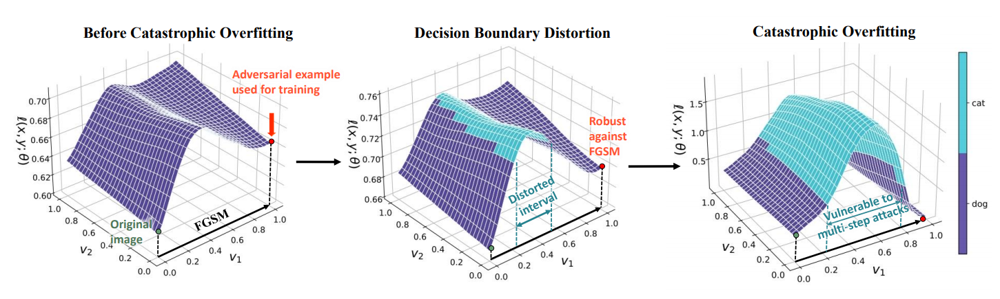
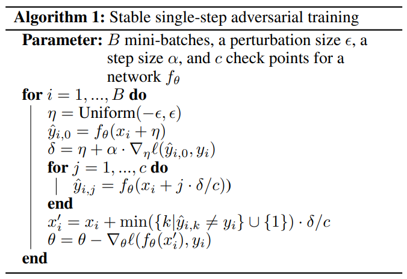

# Understanding Catastrophic Overfitting in Single-step Adversarial Training

**Author:** Hoki Kim, Woojin Lee, Jaewook Lee (Seoul National Univ')

**Paper:** https://arxiv.org/abs/2010.01799

**Venue:** AAAI 2021

## Citation
```
@article{lee2022graddiv,
  title={Graddiv: Adversarial robustness of randomized neural networks via gradient diversity regularization},
  author={Lee, Sungyoon and Kim, Hoki and Lee, Jaewook},
  journal={IEEE Transactions on Pattern Analysis and Machine Intelligence},
  year={2022},
  publisher={IEEE}
}
```

## Requirements

The code requires

* Python==3.6
* torch==1.4
* torchvision==0.5
* torchattacks==2.12
* torchhk==0.85


## Preview

Although fast adversarial training performs well in a short time, a previously undiscovered phenomenon has been identified. That is, after a few epochs with single-step adversarial training, robustness of the model against PGD decreases sharply. This phenomenon is called catastrophic overfitting. 


In this study, we discovered a “decision boundary distortion” phenomenon that occurs during single-step adversarial training and the underlying connection between decision boundary distortion and catastrophic overfitting. We then suggest a simple method that prevents decision boundary distortion by searching the appropriate step size for each image. 


## Decision Boundary Distortion

By recording robust accuracy and adversarial perturbations of fast adversarial training, we found a clue to understand catstrophic overfitting. Below figure illustrates the progress of adversarial training in which catastrophic overfitting occurs.



On the left side of the figure, we can easily observe that the model is robust against FGSM. However, after training the batch, an interval vulnerable to a smaller perturbation than the maximum perturbation appears, whereas the model is still robust against FGSM. This distorted interval implies that the adversarial example with a larger perturbation is weaker than that with a smaller perturbation. As a result, the model with distorted interval is vulnerable to multi-step adversarial attacks. We call this phenomenon “decision boundary distortion.”


To check how to draw the loss surface and get the value of distortion, please refer to [Decision Boundary Disortion.ipynb](https://github.com/Harry24k/catastrophic-overfitting/blob/main/Decision%20Boundary%20Disortion.ipynb).


## Proposed Method

### Algorithm

To resolve this issue, we suggest a simple fix to prevent catastrophic overfitting by forcing the model to verify the inner interval of the adversarial direction.

<p align="center">
  
</p>

### Training

See help (`-h` flag) for detailed parameter list of each script before executing the code.

To train the model, run this command:

#### Stepwise

```bash
python train.py --name "sample" --method "proposed" --model "PRN18" --gpu 0 --scheduler "Stepwise" --epochs 200 --eps 8 --alpha 10 --c 3 --inf-batch 1024 --path "./" --save-type "None"
```

#### Cyclic

```bash
python train.py --name "sample" --method "proposed" --model "PRN18" --gpu 0 --scheduler "Cyclic" --epochs 30 --eps 8 --alpha 10 --c 3 --inf-batch 1024 --path "./" --save-type "None"
```


Then, training records will be printed every epoch.

* Clean : An average standard accuracy over the epoch.
* FGSM : An average robust accuracy against FGSM over the epoch.
* PGD : An average robust accuracy against PGD7 over the epoch.
* GN : An average robust accuracy against Guassian Noise with a standard deviation 0.1 over the epoch.

Each record will be evaluated on the first training batch (Tr) and the first test batch (Te).

At the end of training, it shows a summary of the training records. In addition, the weights of model will be saved to [path + name + ".pth"] (e.g., ./sample.pth) and the records will also be saved to [path + name + ".csv"] (e.g., ./sample.csv).


#### Pretrained Model

We uploaded pretrained models of two methods in './ckp'. Both models are trained with 200 epochs. PreAct ResNet18 is used as the model structure.

* Fast.pth : Fast adversarial training.
* Proposed.pth : Proposed method.


### Evaluation

See help (`-h` flag) for detailed parameter list of each script before executing the code.

To evaluate the model, run these commands:

#### FGSM

```bash
python eval.py --name "sample.pth" --root "./" --model "PRN18" --data-path "FGSM.pt" --gpu 0 --method "FGSM" --eps 8
```

#### PGD

```bash
python eval.py --name "sample.pth" --root "./" --model "PRN18" --data-path "PGD.pt" --gpu 0 --method "PGD" --eps 8 --alpha 2 --steps 50 --restart 10
```

These commands will show you the robust accuracy against FGSM or PGD for the test dataset and save the adversarial images to the data-path.
